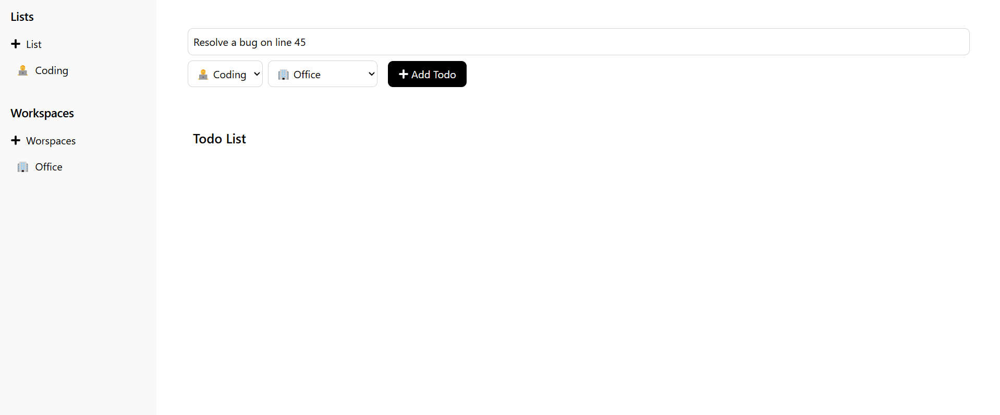
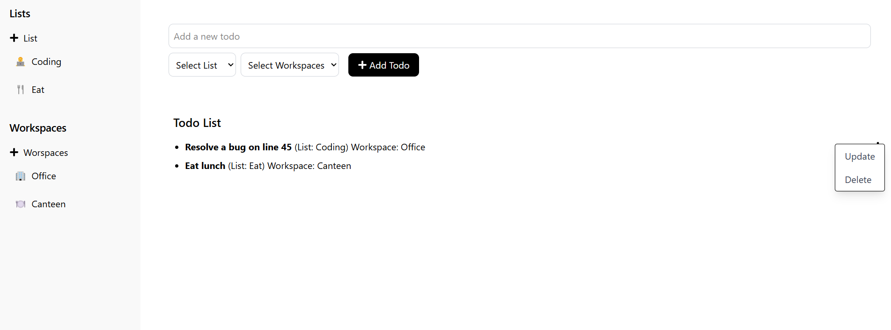
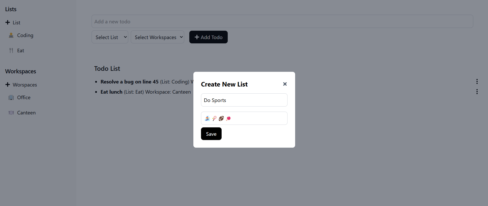

# ✅ Task List Manager

A modern and minimal todo manager built with React, Zustand, and Tailwind CSS. Organize tasks with **Lists** and **Workspaces**, create todos dynamically, and manage everything from a beautiful and responsive UI.

---

## ✨ Features

- 📝 Add todos with descriptions
- 🗂️ Categorize tasks by **Lists** and **Workspaces**
- ➕ Create new lists and workspaces using modals
- 🧠 Global state managed with [Zustand](https://github.com/pmndrs/zustand)
- 🎨 Clean and responsive design with [Tailwind CSS](https://tailwindcss.com/)
- 💾 Extensible logic with a custom store structure

---

## 📸 Screenshots






---

## 🛠️ Tech Stack

- **React** (Functional components & hooks)
- **TypeScript**
- **Zustand** for global state
- **Tailwind CSS** for styling
- **React Icons** for minimal UI icons

---

## 🚀 Getting Started

Clone the repo and run it locally:

```bash
git clone https://github.com/Kelsen23/task-list.git
cd task-list
npm install
npm run dev
```

## 🤝 Contributing

Pull requests and feature suggestions are welcome! Feel free to fork the repo and open a PR.

## 📄 License

This project is licensed under the [MIT License](LICENSE).